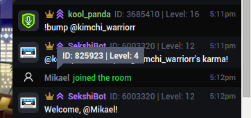

Inline User Info
================

Displays user IDs and levels inline in chat.



## Installation

If you do not have ExtPlug yet, get it [here](https://extplug.github.io).

You can install this plugin by going to your ExtPlug settings menu, pressing
"Install Plugin", and entering this Plugin URL:

```
https://unpkg.com/extplug-inline-user-info
```

## Building

**Note: this section is intended for developers only.**

First, install dependencies:

```bash
npm install
```

Then, use:

```bash
npm run build
```

The plugin will be built using the [ExtPlug CLI](https://github.com/extplug/extplug-cli).

The built plugin will be stored at `build/moderation-user-info.js`.

## License

[MIT](./LICENSE)
